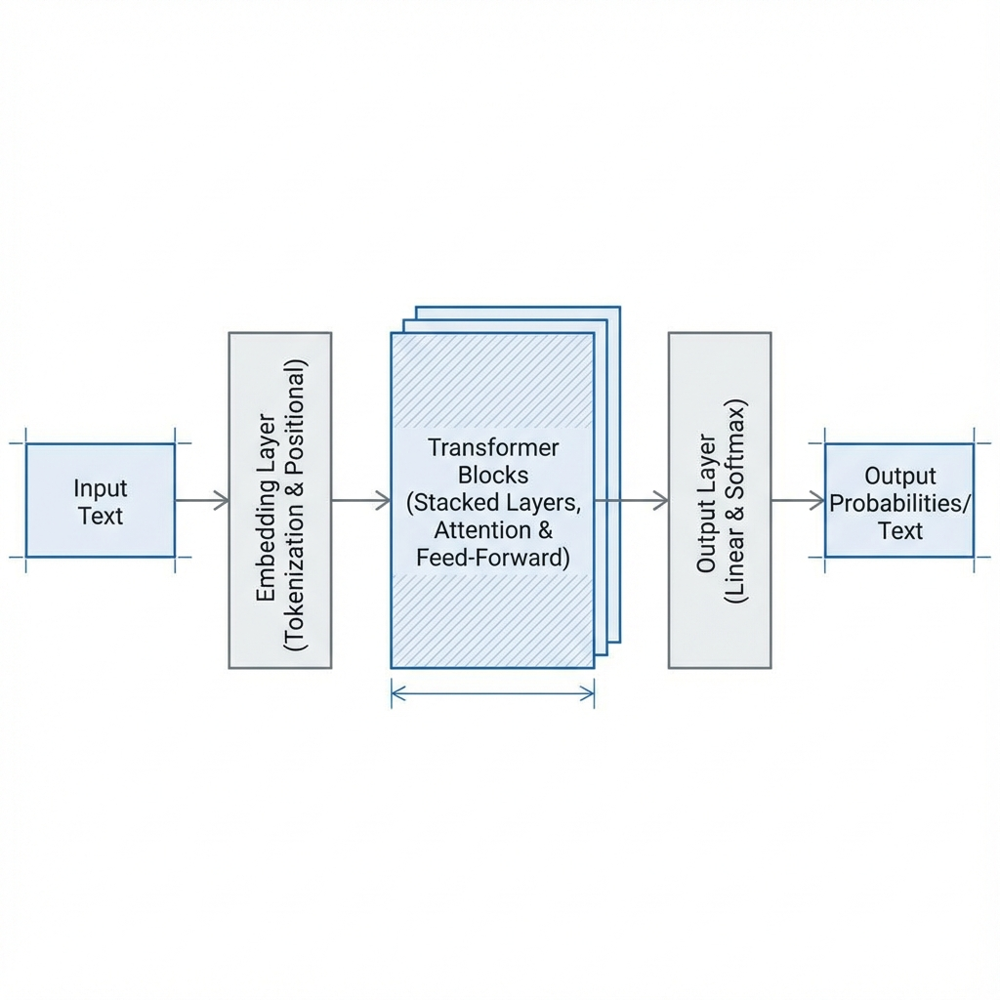

# Large Language Model (LLM) from Scratch

A simple, educational implementation of a GPT-style Large Language Model (LLM), built from the ground up using PyTorch.

## 🚀 Overview
This project serves as a learning journey into understanding how Large Language Models work. It implements a Decoder-only Transformer architecture trained on the `TinyStories` dataset to generate coherent text with a relatively small parameter count (~50-60M).

## 🧠 Visualization


*(A conceptual visualization of the Transformer architecture implemented in this project)*

## 📂 Project Structure
- `Large Language Model From Scratch.ipynb`: The main notebook containing the entire pipeline from data loading to model training and generation.

## 🛠 Features
- **Dataset**: [TinyStories](https://huggingface.co/datasets/roneneldan/TinyStories) (Synthetic short stories for language understanding).
- **Tokenizer**: GPT-2 Tokenizer (via `tiktoken`).
- **Architecture**:
  - Causal Self-Attention (with Flash Attention support).
  - Multi-Layer Perceptron (MLP).
  - Layer Normalization (Pre-Norm).
  - Residual Connections.

## 💻 Tech Stack
- **Language**: Python
- **Framework**: PyTorch
- **Libraries**: `datasets`, `tiktoken`, `numpy`, `tqdm`

## 🏃‍♂️ How to Run
1. Clone this repository.
2. Install dependencies:
   ```bash
   pip install torch numpy datasets tiktoken tqdm
   ```
3. Open the notebook `Large Language Model From Scratch.ipynb`.
   
   [](https://colab.research.google.com/drive/1igh-Xt_EtX6iRc4xH2r3wLeGIdBpvN1V?authuser=3)
4. Run the cells sequentially to train the model and generate text.

## 📝 Learning Outcomes
- Understanding the internals of Transformer blocks.
- Handling data loading and tokenization efficiently.
- Implementing Self-Attention and Causal masking.
- Training loops and loss calculation (Cross Entropy).

---
*Note: This is a learning project aimed at understanding the fundamentals of LLMs.*
